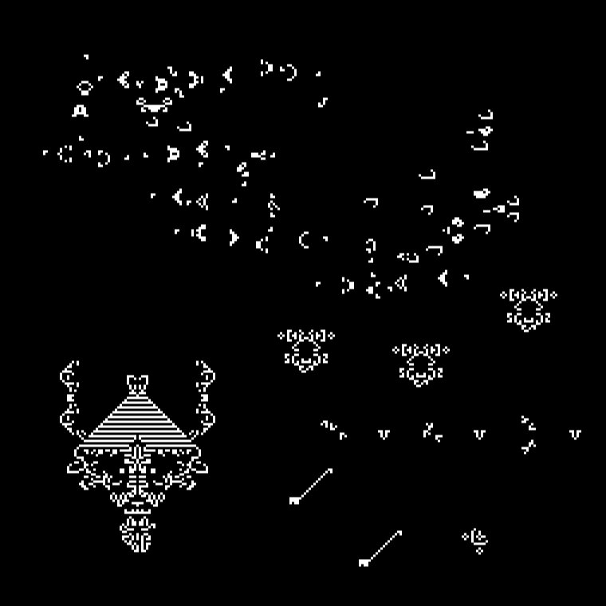
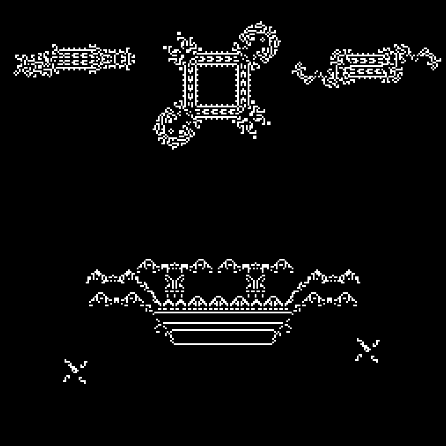

Conway's Game of Life written using Haxe and WebGL. Run it [in your browser](https://www.samcodes.co.uk/project/game-of-life/).

## Features
* Select from thousands of Game of Life patterns, add them to the simulation with one click.
* Speed up, slow down, frame-step, pause and clear the game world.
* Preview and choose your preferred patterns interactively.

## Usage

Run the [demo](https://www.samcodes.co.uk/project/game-of-life/), select a pattern via the dropdown or clicking in the preview area, and click or tap on the game canvas to add it to the simulation. Here it is in action:

## How It Works
The [Game of Life](https://en.wikipedia.org/wiki/Conway%27s_Game_of_Life) is a [cellular automaton](https://en.wikipedia.org/wiki/Cellular_automaton) invented by [John Conway](https://en.wikipedia.org/wiki/John_Horton_Conway) in 1970. It is a simulation that takes place on a two-dimensional orthogonal grid of square cells, each of which can either be dead or alive.

Each time the simulation is updated, every cell in the grid interacts with its eight neighboring cells in accordance with these four rules:

* Any live cell with fewer than two living neighbours dies (isolation).
* Any cell with two or three living neighbours survives this time (survival).
* Any cell with more than three living neighbours dies (overpopulation).
* Any dead cell with three living neighbours comes to life (reproduction).

Conway designed these rules to produce interesting results - even self replicating patterns can be produced. Read more [here](https://en.wikipedia.org/wiki/Conway%27s_Game_of_Life).

## Notes
* The patterns are from the [LifeWiki](http://www.conwaylife.com/wiki/Main_Page) collection. Credit for these goes to the original creators.
* This project was inspired by [Golly](https://sourceforge.net/projects/golly/), a cross-platform cellular automaton simulator.
* If you have any questions or suggestions then [get in touch](https://twitter.com/Sam_Twidale) or open an issue.

## License
* The Haxe and webpage code here, but not the pattern files, are licensed under the [GPL](https://www.gnu.org/licenses/quick-guide-gplv3.en.html).
* The [noUiSlider](https://github.com/leongersen/noUiSlider) settings sliders are WTFPL.
* The [three.js](https://github.com/mrdoob/three.js/) library is MIT.
